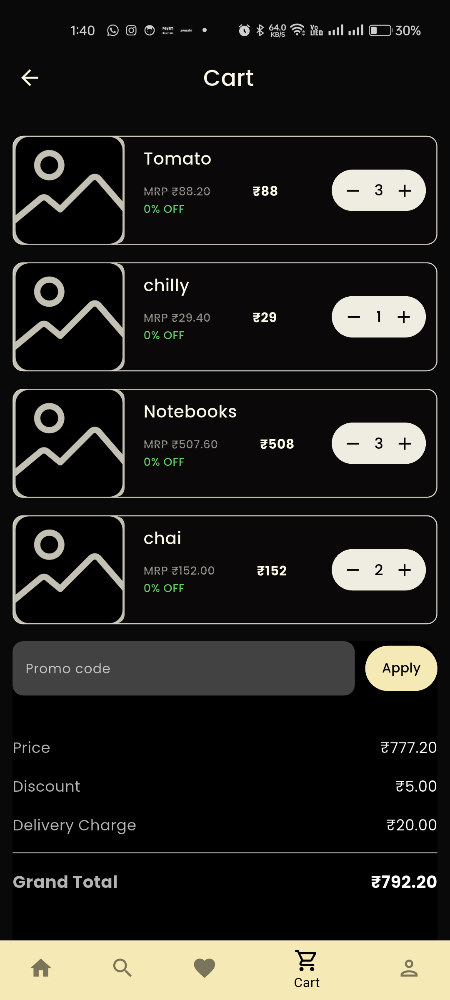

# 🛒 Modern Store (Modern Grocery)

A feature-rich, modern E-Commerce & Grocery Shopping application built with **Flutter**. Modern Store provides a seamless shopping experience for users, real-time location services for delivery, multi-language support, and a comprehensive Admin dashboard with sales charts and PDF invoice generation.

---

## 📸 Screenshots

| Overview 1 | Overview 2 |
| :---: | :---: |
|  |  |


---

## ✨ Features

- **🔑 Authentication & Onboarding**: Seamless user onboarding with splash screens, login, and registration.
- **🛍️ Product Browsing & Search**: Categorized products, interactive banners, search, and detailed product views with ratings and reviews.
- **🛒 Shopping Cart & Orders**: Cart management, order placement, order history, and live tracking.
- **📍 Location & Delivery Services**: Automatic location detection using `geolocator` and `geocoding` for accurate address selection and delivery tracking.
- **📊 Admin Dashboard**: Dedicated admin suite featuring analytical charts (`fl_chart`), product management, and PDF invoice generation/printing (`pdf`, `printing`).
- **🌐 Localization & Multi-language Support**: Multi-language support for diverse user bases.
- **🎨 Modern UI/UX**: Built with `flutter_screenutil` for responsive design across multiple screen sizes, custom fonts, dark/light aesthetics, and smooth animations.

---

## 🛠️ Tech Stack & Architecture

- **Framework**: [Flutter](https://flutter.dev/) (Dart SDK `^3.6.0`)
- **State Management**: `flutter_bloc` / `bloc`, `provider`
- **UI Components & Utilities**: `flutter_screenutil`, `carousel_slider`, `smooth_page_indicator`, `fl_chart`, `shimmer`, `flutter_svg`, `cached_network_image`, `badges`
- **Location**: `geolocator`, `geocoding`
- **Local Storage & HTTP**: `shared_preferences`, `http`
- **PDF & Printing**: `pdf`, `printing`

---

## 🚀 Getting Started

### Prerequisites

- [Flutter SDK](https://docs.flutter.dev/get-started/install) installed on your machine.
- Android Studio / VS Code with Flutter & Dart extensions.

### Installation

1. **Clone the repository**:
   ```bash
   git clone https://github.com/aliparamban37-cyber/Modernstore.git
   cd Modernstore
   ```

2. **Install dependencies**:
   ```bash
   flutter pub get
   ```

3. **Run the app with Flavors**:
   - **User App**:
     ```bash
     flutter run --flavor user
     ```
   - **Admin App**:
     ```bash
     flutter run --flavor admin
     ```

---

## 🎨 Product Flavors

This project configures two product flavors:

| Flavor | Application ID | App Name | Description |
| :--- | :--- | :--- | :--- |
| **`user`** | `com.example.modern_grocery.user` | Modern Grocery | Shopping app for customer users |
| **`admin`** | `com.example.modern_grocery.admin` | Mg Admin | Management dashboard for store admins |

---

## 📦 Building APK & Releases

### Build Android APK by Flavor

To generate release APKs for specific flavors:

- **User App APK**:
  ```bash
  flutter build apk --flavor user --release
  ```
  > Output: `build/app/outputs/flutter-apk/app-user-release.apk`

- **Admin App APK**:
  ```bash
  flutter build apk --flavor admin --release
  ```
  > Output: `build/app/outputs/flutter-apk/app-admin-release.apk`

- **Split APKs per CPU architecture**:
  ```bash
  flutter build apk --flavor user --split-per-abi
  flutter build apk --flavor admin --split-per-abi
  ```

### Build Android App Bundle (Google Play Store)

To generate AAB bundles for Play Store publishing:

- **User App Bundle**:
  ```bash
  flutter build appbundle --flavor user --release
  ```
  > Output: `build/app/outputs/bundle/userRelease/app-user-release.aab`

- **Admin App Bundle**:
  ```bash
  flutter build appbundle --flavor admin --release
  ```
  > Output: `build/app/outputs/bundle/adminRelease/app-admin-release.aab`

---

## 📊 Bulk Stock Management & Excel Sync (480 Products)

Manage and bulk-update inventory for all **480 store products** directly via Excel without entering stock one-by-one.

### 📁 Files & Tools Included:
1. **`ModernStore_All_480_Products_Stock.xlsx`**: Excel file containing all 480 live registered products with official MongoDB ObjectIDs, English names, Malayalam search names, SKU codes, categories, selling prices, current DB stock, and automatic `=Current+Add` formulas.
2. **`stock_inventory_hub.html`**: Standalone offline web dashboard to view, filter, live search (in English or Malayalam), and edit stock quantities directly in any laptop browser (Chrome, Edge).
3. **`sync_stock_to_server.py`**: Automated Python script that reads the edited Excel sheet and syncs all new stock quantities directly to the server database (`http://200.234.34.162:4055/api/inventory/addStocks`).

---

### ⚡ Quick Usage Workflow:

#### 1. Edit Stock Quantities
- Open **`ModernStore_All_480_Products_Stock.xlsx`** in Microsoft Excel, WPS, or Google Sheets.
  *(Alternatively, double-click **`stock_inventory_hub.html`** to edit in browser and export)*
- Enter the incoming stock quantities in the **`Stock To Add (Type New Qty Here)`** column (Column **L**).
- Save the Excel file (`Ctrl + S`).

#### 2. Run the One-Click Sync Command:
Open PowerShell / Terminal in the project root directory and run:

```powershell
python sync_stock_to_server.py
```

> **Custom Excel file name**: If you renamed or moved the file:
> ```powershell
> python sync_stock_to_server.py "path/to/your_stock_file.xlsx"
> ```

#### 3. What the script does:
- Validates the Excel file and filters all products where `Stock To Add > 0`.
- Shows a preview list of products to be updated.
- Connects directly to backend API `/inventory/addStocks`.
- Updates the MongoDB database with real-time progress indicators:
  ```text
  [1/25] ✅ Urulakizhangu -> Added +50 units
  [2/25] ✅ Onion -> Added +100 units
  ...
  🎉 Stock Sync Finished! Successfully Updated: 25 products
  ```

---

## ❓ Troubleshooting

### Gradle Download / Connection Timeout Error
If you see the error: `Gradle threw an error while downloading artifacts from the network` or `Connection timed out: connect`:

1. **Use Fast CDN Mirror**:
   In `android/gradle/wrapper/gradle-wrapper.properties`, switch to a fast CDN mirror:
   ```properties
   distributionUrl=https\://mirrors.cloud.tencent.com/gradle/gradle-8.7-bin.zip
   ```
2. **Alternative: Connect to Mobile Hotspot/VPN** for the initial Gradle download.
3. **Re-run the build command**:
   ```bash
   flutter build apk --flavor user --release
   ```

---

## 📂 Project Structure

```text
lib/
├── bloc/           # BLoC state management logic
├── localization/   # Internationalization & language files
├── repositery/     # Data repositories & API handlers
├── services/       # Services (location, network, auth, etc.)
├── ui/             # Screen views & UI layouts
│   ├── Home_/      # Home dashboard & category views
│   ├── admin/      # Admin dashboard & analytics
│   ├── auth_/      # Login & Signup screens
│   ├── cart_/      # Shopping cart & checkout
│   ├── delivery/   # Delivery panel & order dispatching
│   ├── location/   # Map & location management
│   ├── order/      # Order history & tracking
│   ├── products/   # Product details & listing
│   └── settings/   # App settings & profile
└── widgets/        # Reusable custom UI components
```


